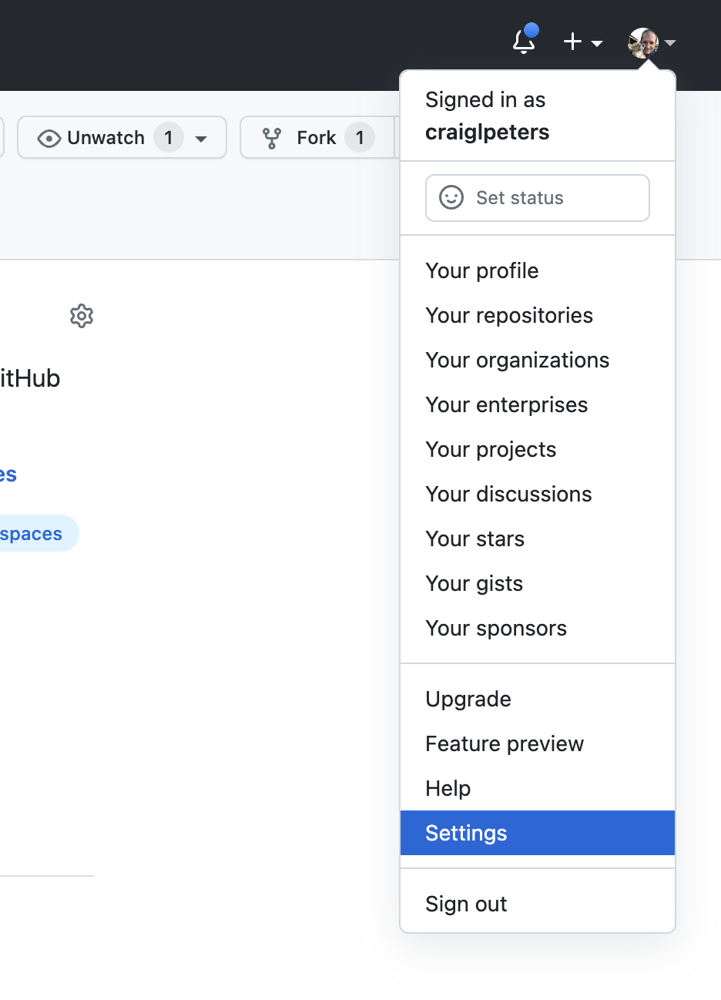
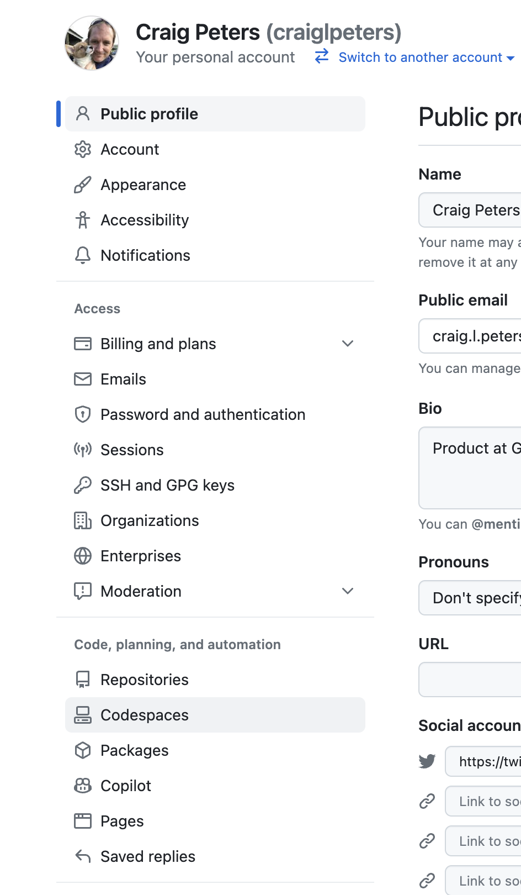
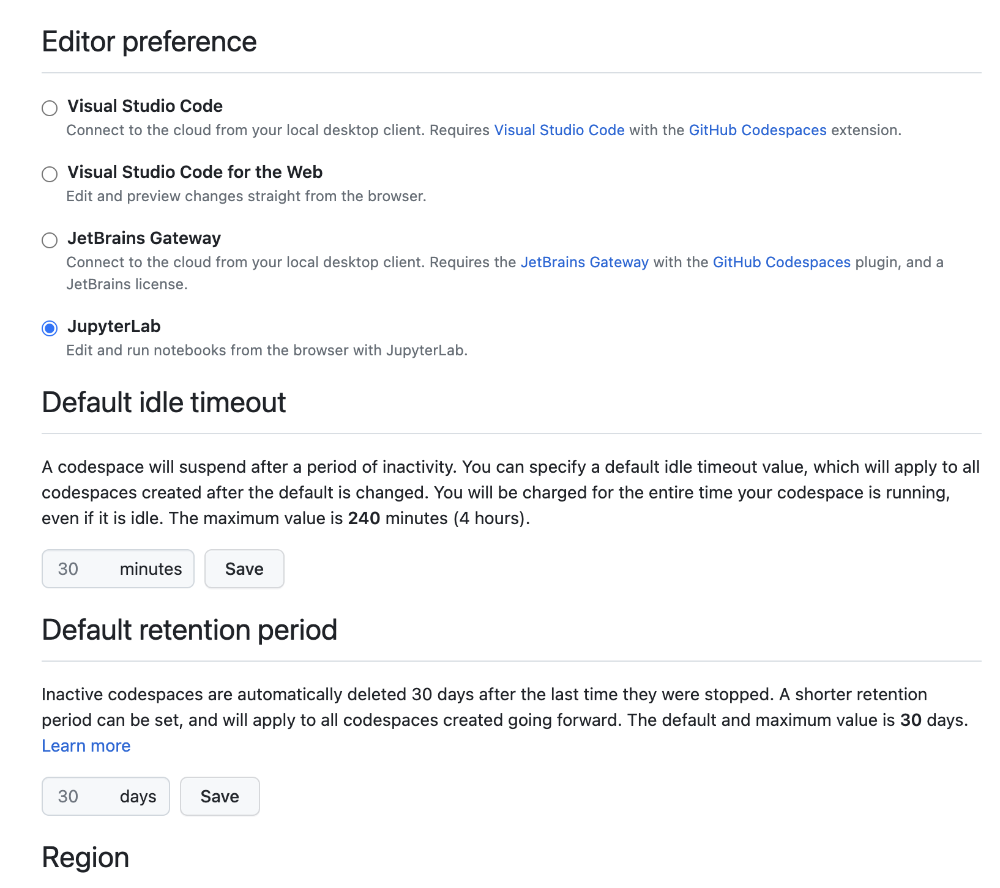
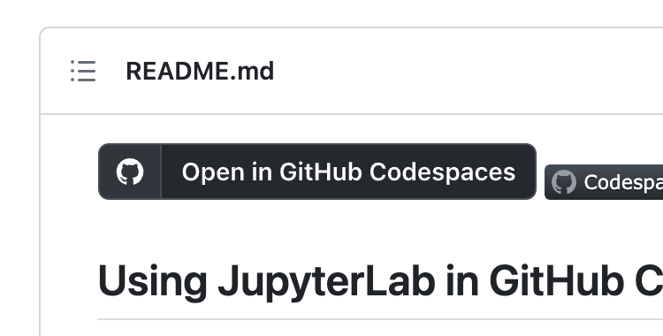
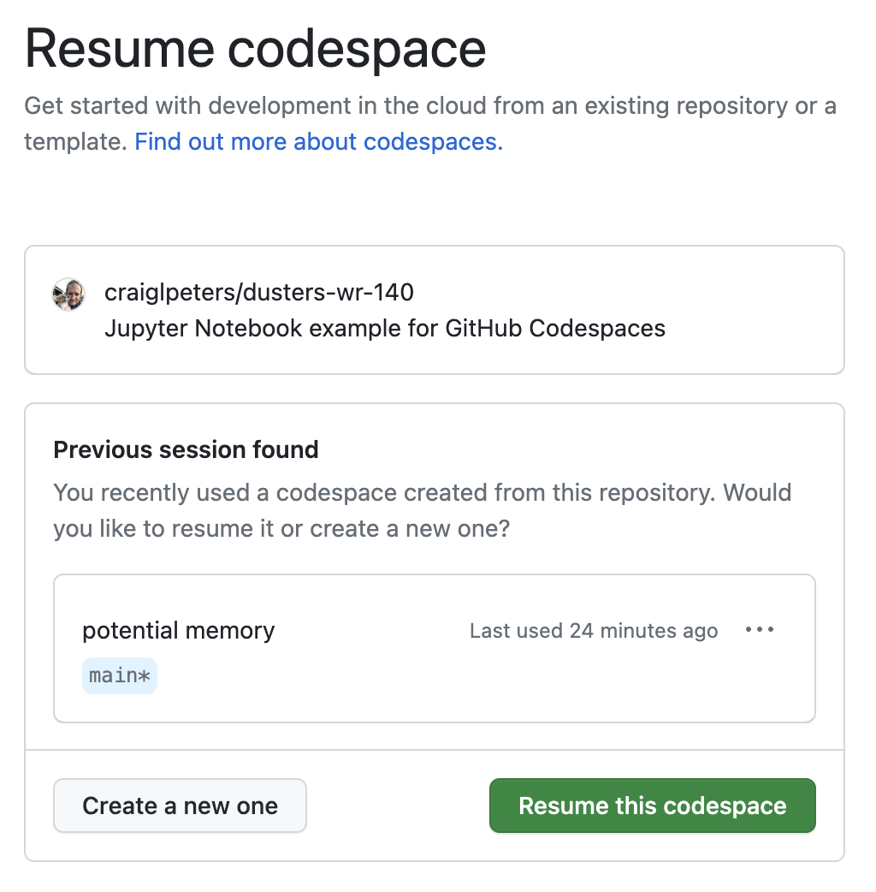
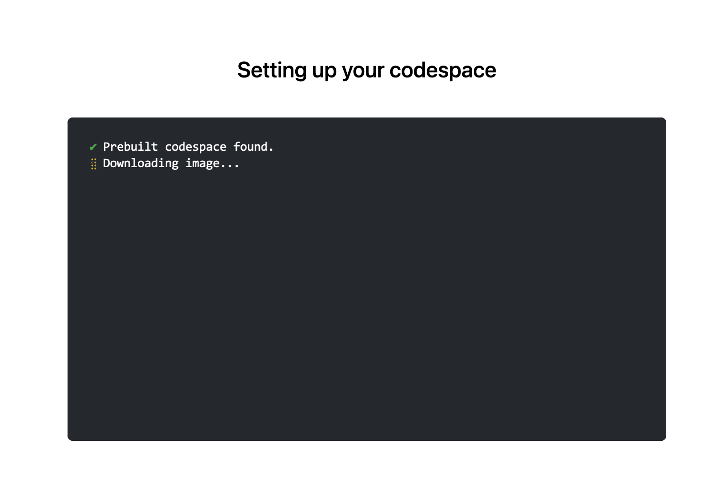
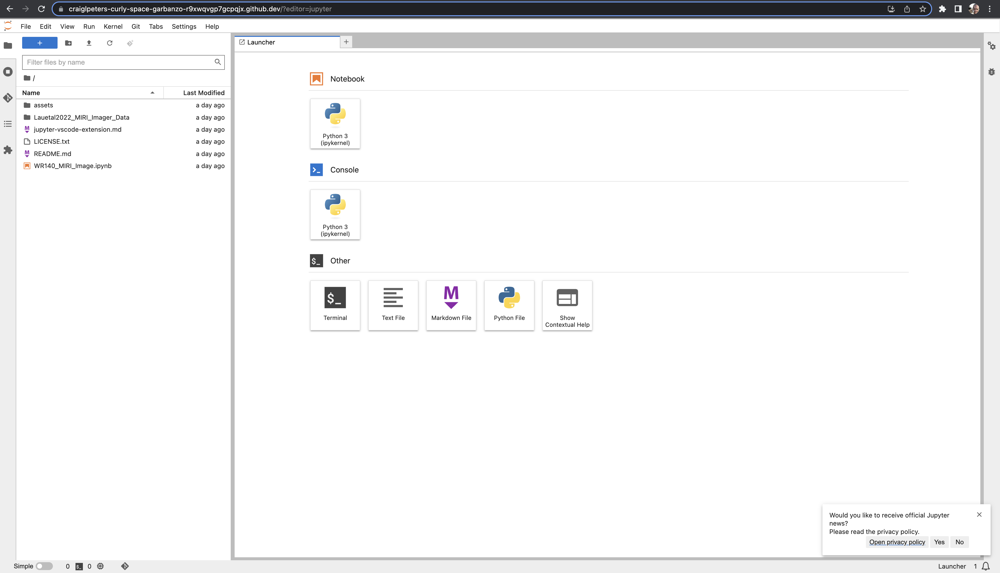
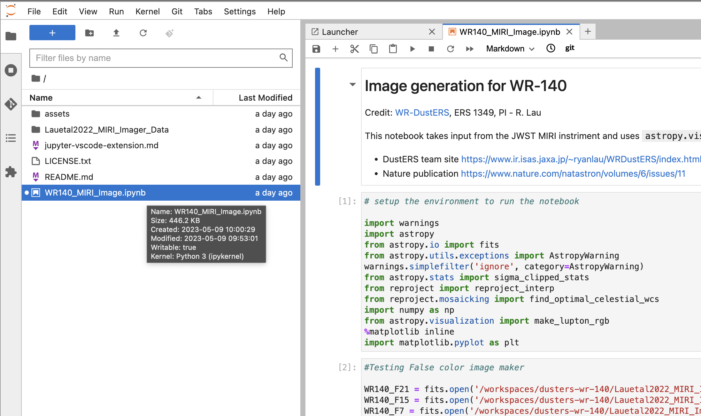
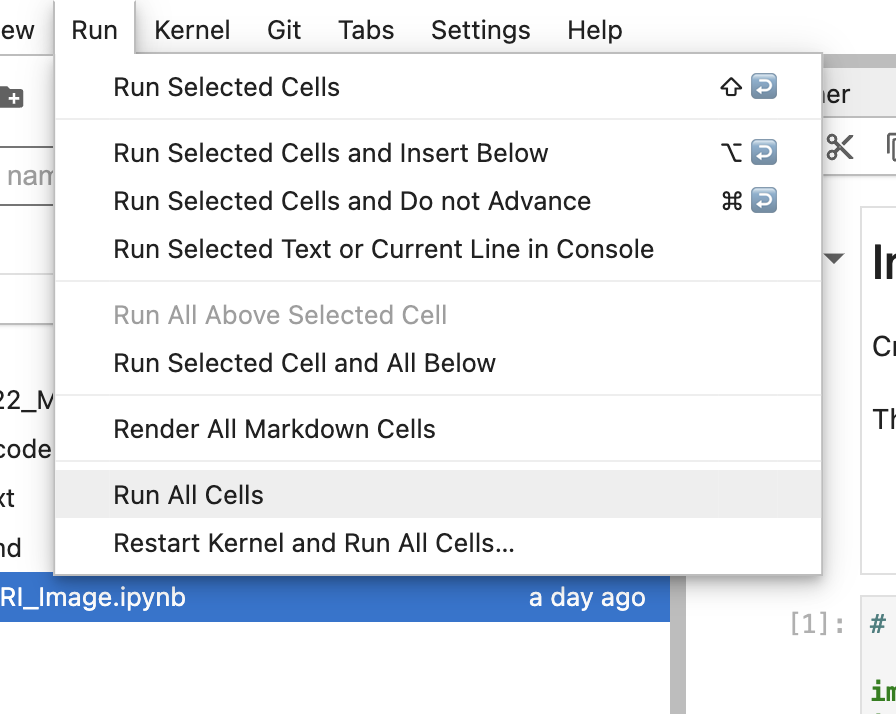
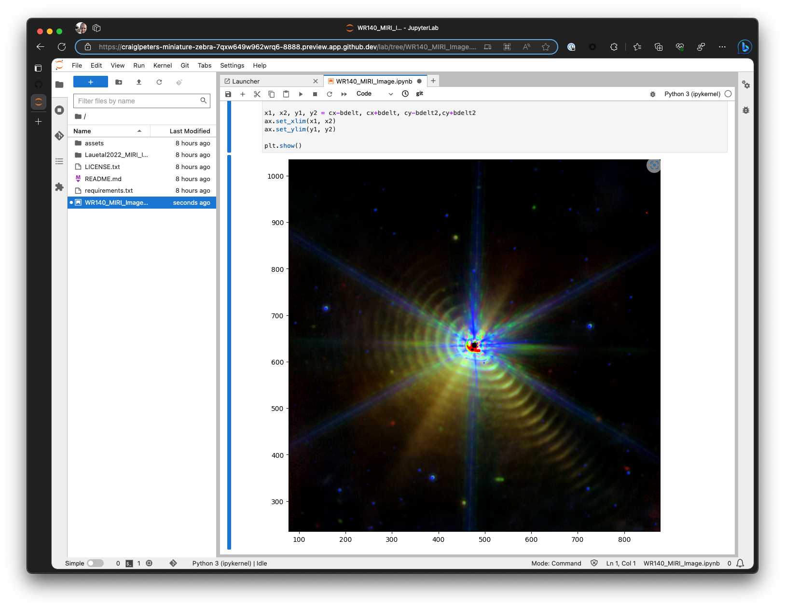

## Using JupyterLab in GitHub Codespaces

The [Jupyter Project](https://jupyter.org/) creates powerful open source tools for interactive computing. Jupyter tools power many of the most important discoveries and learning experiences in computing.

[GitHub Codespaces](https://github.com/features/codespaces) makes exploration, development, and experimentation using notebooks in Jupyter simpler by automating the set up and management of development environments so you don't have to configure anything on your computer, and you can take advantage of powerful cloud computing environments. This repository provides a straightforward, yet impactful, way to explore the power of using JupyterLab in Codespaces.

## The example - image generation from the James Webb Space Telescope MIRI instrument for WR-140

**Credit for the data and notebook:** WR-DustERS, [ERS 1349](https://www.stsci.edu/jwst/science-execution/approved-programs/dd-ers/program-1349), PI - R. Lau, personal communication, April 2023

This repository contains a Jupyter notebook that converts processed data from the JWST MIRI instrument and uses `astropy.visualization` to render an image of the WR-140 binary star system showing the dynamically generated dust rings. For more details about the research see:

 - DustERS team site https://www.ir.isas.jaxa.jp/~ryanlau/WRDustERS/index.html
 - Nature publication https://www.nature.com/natastron/volumes/6/issues/11

## Working with the Jupyter Notebook in Codespaces

The steps below illustrate using JupyterLab as the prefered IDE for Codespaces. There are many other ways to use Jupyter, and [some are detailed below](#other-ways-to-use-jupyter-in-codespaces).

1. Go to your GitHub settings, and select Codespaces

Then return to this page at https://github.com/craiglpeters/dusters-wr-140

2. Set JupyterLab as your preferred IDE

3. Then CMD + click on the ["Open in GitHub Codespaces"](https://codespaces.new/craiglpeters/dusters-wr-140?quickstart=1) badge at the top of this page to open the start in a new tab so you can keep going through these steps. 

You won't have to install anything on your computer to run the notebook! (If you are already in a codespace, you don't need to click the button again - nothing bad will happen, but, you know :stuck_out_tongue_winking_eye:, [Inception](https://en.wikipedia.org/wiki/Inception).)

> Note: GitHub provides you 120 core-hours of Codespaces for free each month. The Jupyter kernel requires some resources, so it is recommended to use at least a 4 core Codespaces machine for this repository, which means you'll get 30 hours free a month. See [About Billing for GitHub Codespaces](https://docs.github.com/en/billing/managing-billing-for-github-codespaces/about-billing-for-github-codespaces) for more details.

4. If you already have a codespace running with the current repository you will be asked if you want to connect to it, or start a new one

5. Codespaces may show you a brief "setting up" screen

6. Next you'll land on the JupyterLab launcher page

7. Select the WR140_MIRI_Image.ipynb notebook by double-clicking it

> Note: Codespaces has started and connected you automatically to the correct IPython kernel

8. Select "Run All Cells" from the Run menu

9. Scroll down and look at the gorgeous image of the spiraling dust being emitted from the rotating binary star system observed by the JWST MIRI instrument

## Find the Community and Learn More

You can then explore more about [GitHub Codespaces in the documentation](https://docs.github.com/en/codespaces), and find others in the [Codespaces Community Discussions](https://github.com/orgs/community/discussions/categories/codespaces?discussions_q=is%3Aopen+sync+category%3ACodespaces). 

This repository is configured with a Dev Container to install all the tools and settings you need for your Codespaces environment so you don't have to worry about them. For more information about how this repository is configured, and how you can do this for your own projects, see the [Codespaces: Introduction to Dev Containers](https://docs.github.com/en/codespaces/setting-up-your-project-for-codespaces/adding-a-dev-container-configuration/introduction-to-dev-containers) documentation.

### Other ways to use Jupyter in Codespaces

There are many [other ways (this link outlines a few in more detail)](/jupyter-other-ways.md) you can use JupyterLab in Codespaces:
1. Open the WR140_MIRI_Image.ipynb document by clicking on it in the file Explorer in VS Code for the Web.
1. Run a Jupyter server manually in a Codespace by typing `jupyter lab` in the terminal, then CMD+Click one of the published URLs
1. Select the `Open in...` option for the already running codespace listed on the https://github.com/codespaces page, and choose Jupyter
1. Start a codespace from the Code dropdown menu in a GitHub Pull Request
1. Start a codespace from a new branch created from the Issues developmet brach dialog
1. Start a codespace from the VS Code client
1. Use the `gh cs jupyter` cli 

### Codespaces and VS Code Jupyter Extension Documentation

- [Codespaces Documentation: Getting Started with GitHub Codespaces for Machine Learning](https://docs.github.com/en/codespaces/developing-in-codespaces/getting-started-with-github-codespaces-for-machine-learning)
- [VS Code Marketplace: Jupyter Extension](https://marketplace.visualstudio.com/items?itemName=ms-toolsai.jupyter)
- [VS Code: Jupyter Notebooks](https://code.visualstudio.com/docs/datascience/jupyter-notebooks)
- [Dev Containers Specification](https://containers.dev)
  - Default image which contains JupyterLab https://github.com/devcontainers/images/tree/main/src/universal
- This repository is configured to start quickly by using Codespaces Prebuilds. A prebuild is used to install the python packages required for the notebook ahead of time, so that when you start a codespace you don't have to wait for the package installation to complete. To learn more see [About GitHub Codespaces Prebuilds](https://docs.github.com/en/codespaces/prebuilding-your-codespaces/about-github-codespaces-prebuilds).
- GitHub CLI https://docs.github.com/en/codespaces/developing-in-codespaces/using-github-codespaces-with-github-cli#open-a-codespace-in-jupyterlab